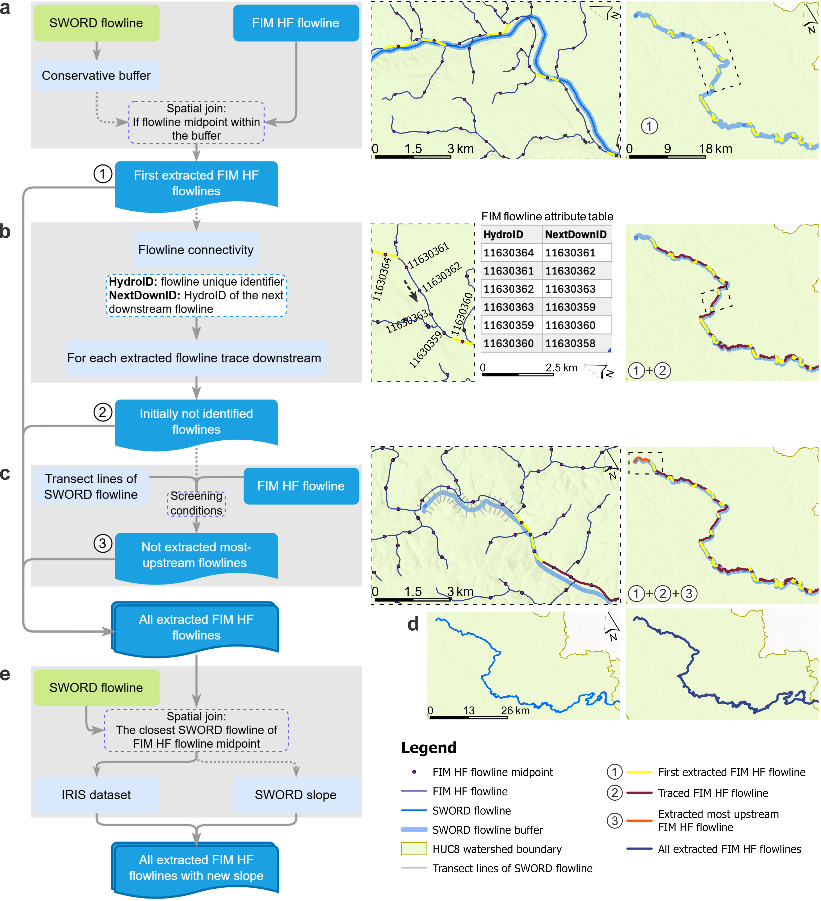

# Framework for Spatially Joining NOAA OWP HAND-FIM Hydrofabric Flowlines with SWORD Flowlines 

  

### **River Flowlines Spatial Join (RiverJoin)**

  

| | |
| --- | --- |
|  | The recently developed global ICESat-2 River Surface Slope (IRIS) dataset utilizes the Surface Water and Ocean Topography (SWOT) River Database (SWORD) flowlines to carry its data. **RiverJoin** was originally developed to align the reach flowlines between the NOAA OWP HAND-FIM Hydrofabric (FIM HF) and the IRIS dataset, aiming to improve river slope data in FIM HF. To achieve this, **RiverJoin** performs a spatial join that addresses differences in flowline sources and integrates IRIS data into FIM HF. It can also spatially join any two linear river features from different sources, provided that there are fields indicating river connectivity (e.g., a unique reach identifier and its corresponding downstream reach), with modifications of a few fields to adapt to specific cases. This is developed under the Surface Dynamics Modeling Lab (SDML) as part of a project funded by the Cooperative Institute for Research to Operations in Hydrology (CIROH). |

### **Background**

  

The NOAA OWP operational Flood Inundation Mapping (FIM) forecasting framework uses the NHDPlusHR DEM to calculate slope as Manning’s equation parameter for compiling the Synthetic Rating Curves (SRC). The SRCs translate the National Water Model streamflow forecasts into stage and inundation extent at river reach scale nationwide using the Height Above Nearest Drainage approach (referred to as NOAA OWP HAND-FIM) to warn communities of potential floods. River slope is asserted to be a major source of uncertainty there. The recently developed global IRIS dataset, known for its accuracy, holds potential for improvements for this. To leverage this potential, we developed **RiverJoin**, a spatial joining approach that aligns the reaches between FIM HF and IRIS, addressing differences in reach flowline sources. This resulted in the integration of IRIS river slopes into the spatially corresponding FIM HF main-stream reaches.

Additionally, **RiverJoin** is a flexible to spatially join any two river flowline datasets, provided they include connectivity fields. This makes it a valuable tool for integrating and harmonizing river datasets from multiple sources.

### **How the framework works**

  

The major steps in this framework for achieving the spatial join are shown in Fig. 1.

**Step 1**: First extract FIM HF flowlines based on the SWORD flowline buffer (Fig. 1a)

**Step 2**: Trace downstream based on connectivity to get the initially unextracted FIM HF flowlines (Fig. 1b)

**Step 3**: Extract any remaining unextracted flowlines (most are likely the most upstream ones) using short lines along and perpendicular to the SWORD flowlines (Fig. 1c)

**Step 4**: Combine all the extracted flowlines into a single file (Fig. 1d)

**Step 5**: Perform a spatial join to transfer data from IRIS (which uses SWORD flowlines) to the extracted FIM HF flowlines (Fig. 1e)

<em>Fig. 1. Flowchart of identifying and spatially joining FIM HF flowlines with corresponding SWORD flowlines. Middle-column sub-figures enlarge the dashed-line boxed areas in the third column.</em>
### **Tool Usage**

  

The **RiverJoin** framework is currently available only as an ArcGIS Pro Jupyter Notebook (JN) file (RiverJoin_OpenInArcGIS.ipynb), which users can download from here and directly open and run in ArcGIS Pro (version 3.4.0 or later). The major steps mentioned above have been integrated as individual functions in the JN file. Only a few places—mainly the field names and filtering rules—require modification by users according to their own data. These sections have been marked with comments, such as [Replace/Re-define...].

The most essential modifications required from users are in the first and last code cells of the JN file. In the first cell, users need to set the paths to save the output files, while in the last cell, they must specify both the paths and the field names of their flowline data when calling the predefined functions.

Overall, all necessary modifications have been clearly indicated with [Replace/Re-define...].

We have also provided example data [here](https://drive.google.com/drive/folders/1Grnoz6cY6uj9FFez9bLrr0Qk9t2gn0xO?usp=sharing). After downloading the data, users only need to specify the paths to the example data on their computer in the JN file and run it to obtain the results shown in Fig. 1.

### **Acknowledgements**

  

| | |
| --- | --- |
|  | Funding for this project was provided by the National Oceanic & Atmospheric Administration (NOAA), awarded to the Cooperative Institute for Research to Operations in Hydrology (CIROH) through the NOAA Cooperative Agreement with The University of Alabama (NA22NWS4320003). |

### **For More Information**

  

#### **If you encounter any issues while using the framework, feel free to contact us:**

<a href="https://geography.ua.edu/people/sagy-cohen/" target="_blank">Dr. Sagy Cohen</a>
 (sagy.cohen@ua.edu),
Dr. Yixian Chen (ychen223@ua.edu), Supath Dhital (sdhital@crimson.ua.edu)
